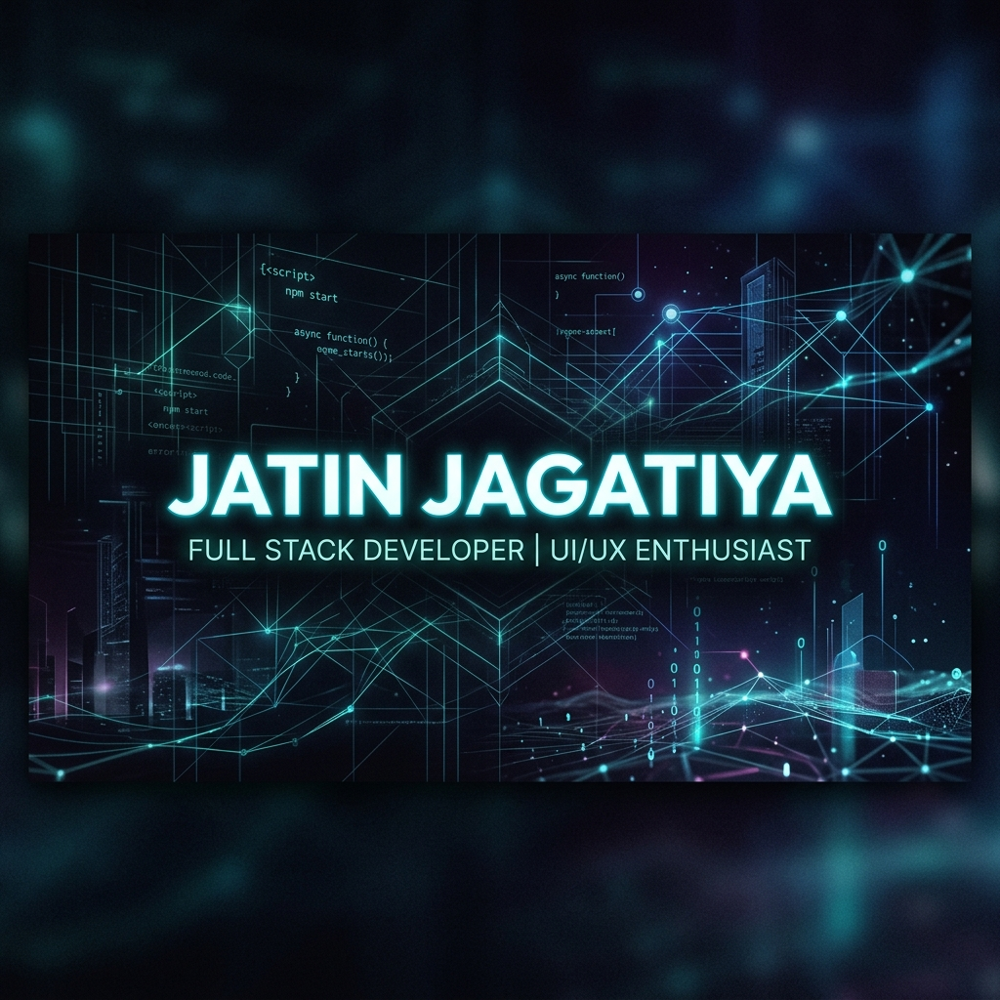

  

<h1 align="center">Hey there! I'm Jatin Jagatiya 👋</h1>

  

  

---

### 🚀 About Me
I am a passionate **Web Developer** dedicated to building high-performance web applications and seamless digital experiences. With a strong foundation in the **React ecosystem** and **Python**, I love transforming complex ideas into intuitive, user-friendly solutions.

- 🔭 **Current Focus:** Building scalable architectures and modern UI/UX components.
- 🌱 **Learning:** Deep diving into Advanced System Design.
- 💬 **Expertise:** React, Node.js, Express, Python, and SQL/NoSQL Databases.
- ⚡ **Goal:** To create impact through code and continuous innovation.

---

### 🛠️ My Tech Stack

<table width="100%">
<tr>
  <td align="center" width="220">
    <strong>Languages</strong>
  </td>
  <td align="center" width="500">
    
  </td>
</tr>
<tr>
  <td align="center" width="220">
    <strong>Frontend</strong>
  </td>
  <td align="center" width="500">
    
  </td>
</tr>
<tr>
  <td align="center" width="220">
    <strong>Backend</strong>
  </td>
  <td align="center" width="500">
    
  </td>
</tr>
<tr>
  <td align="center" width="220">
    <strong>Database</strong>
  </td>
  <td align="center" width="500">
    
  </td>
</tr>
<tr>
  <td align="center" width="220">
    <strong>Tools</strong>
  </td>
  <td align="center" width="500">
    
  </td>
</tr>
</table>

 

---

### 📊 GitHub Analytics

  <table border="0">
    <tr>
      <td>
        
      </td>
    </tr>
  </table>
   
  

---

### 🌟 Featured Projects

| Project | Description | Link |
| :--- | :--- | :--- |
| 🍱 **TiffinZone** | Online tiffin service platform for seamless meal ordering. | [Visit Site](https://tiffin-zone.web.app/) |
| 🚛 **Transpocore** | A robust Transport Management System for vehicle & logistics tracking. | [Visit Site](https://transpocore.web.app/) |
| 🎬 **Movie Intelligence** | Python-based ML system for predicting movie budgets and trends. | [Visit Site](https://movie-intelligence-ial2.onrender.com) |

---

### 🌐 Let's Connect

   
   
   
   
  

---

<!-- Contribution Snake -->

  

  <b>✨ Let's build something amazing together! ✨</b>

<!-- Footer -->

